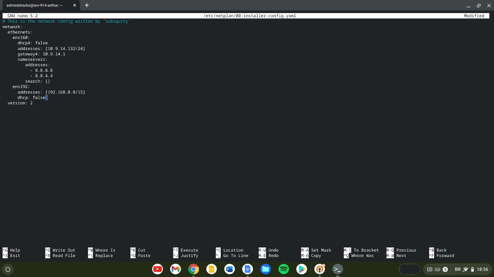
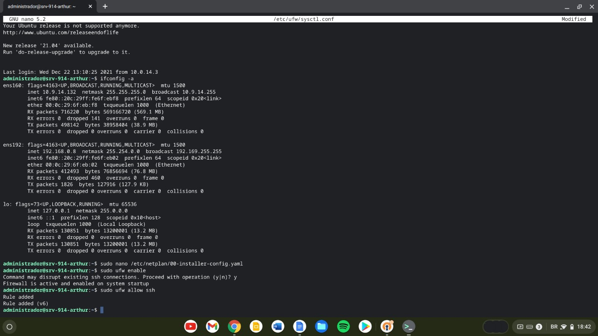
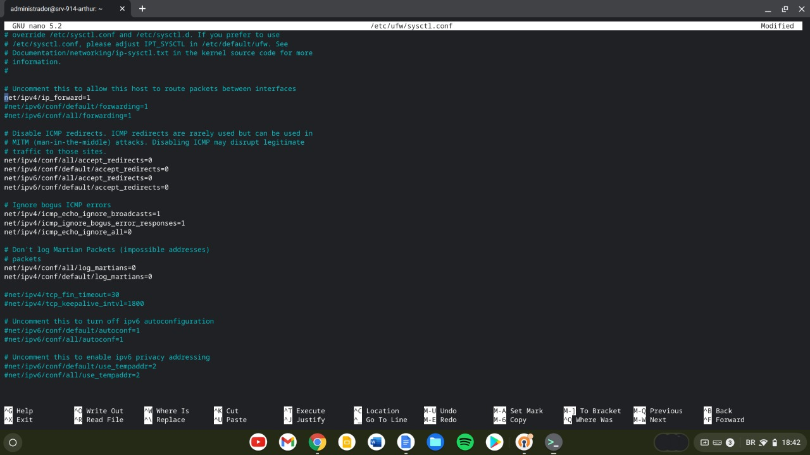
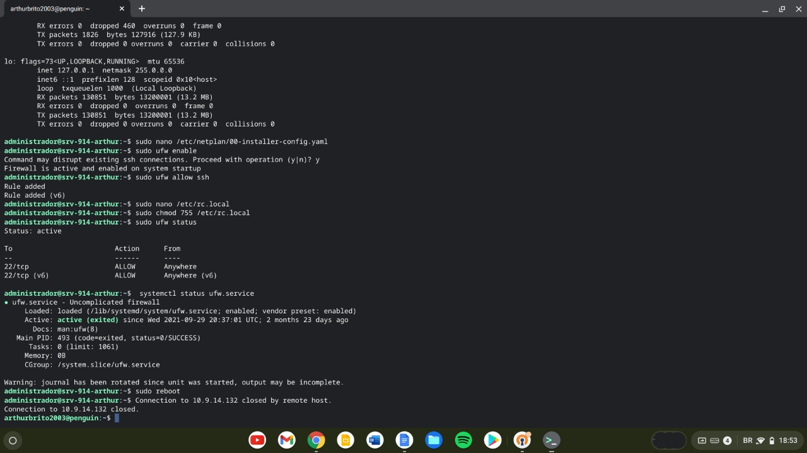

## Configurando servidor DNS

Utilizaremos o comando:

```shell
$ ifconfig -a
```


E então podemos obter os dados da rede e iniciarmos a configuração.
___
### Vamos começar!

* primeiro vamos utilizar comando `$ nano /etc/netplan/00-installer-config.yaml` no modo super user para editar o arquivo e adicionar linhas para configuração estática do IP



* apos a configuração estática do IP podemos iniciar a configuração do gateway
  * habilitemos o firewall
  ```shell
  $ sudo ufw enabe
  ```
  * e vamos conceder o acesso ao SSH
  ```shell
  $ sudo ufw allow ssh
  ```
  
  * e então habilitar o forwarding removendo o comentario no arquivo
  ```shell
  $ sudo nano /etc/ufw/sysctl.conf
  ```
  ```diff
  --  # net/ipv4/ip_forwarding=1
  ++  net/ipv4/ip_forwarding=1
  ```
  
  * e então é chegada a hora de configurar o script definido pelo professor [disponível aqui](https://github.com/alaelson/labredes2021/blob/main/network/nat/readme.md) definido no tópico 6
  * tornaremos o arquivo executável usando o comando
  ```shell
  $ sudo chmod 755 /etc/rc.local
  ```
  * e então, verificaremos o status do firewall usando o comando
  ```shell
  $ sudo ufw status
  ```
  > se tudo estiver ok um status (OK) irá aparecer pra você
  * e então reiniciaremos a máquina, usando o comando
  ```shell
  $ sudo reboot
  ```
  
  > apos a reinicialização da maquina podemos prosseguir
  * iremos editar o arquivo `/etc/rc.local` para faze-lo atender as [especificações propostas](https://github.com/alaelson/labredes2021/blob/main/network/nat/readme.md) 
  > Após essa configuração nosso arquivo está com sua disponibilidade externa garantida e pronto pra atuar com o dns

Após a configuração do DNS podemos enfim iniciar a configuração do [samba](../samba/server)

<center> Arapiraca - 2021 </center>