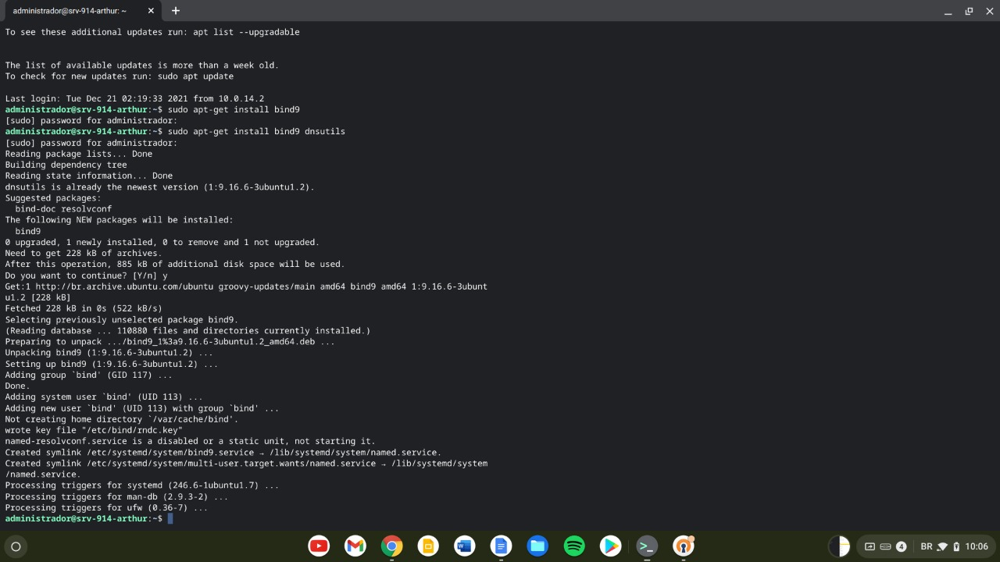
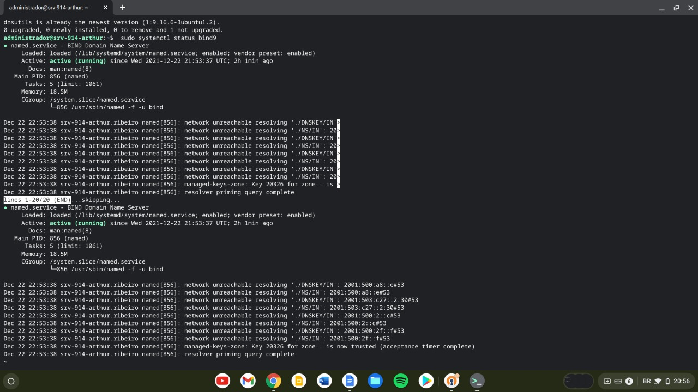
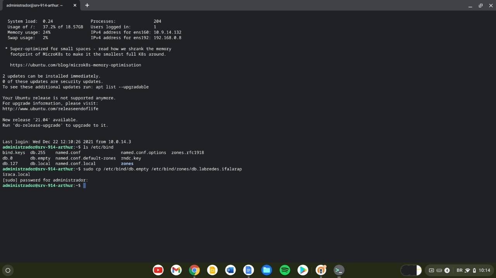
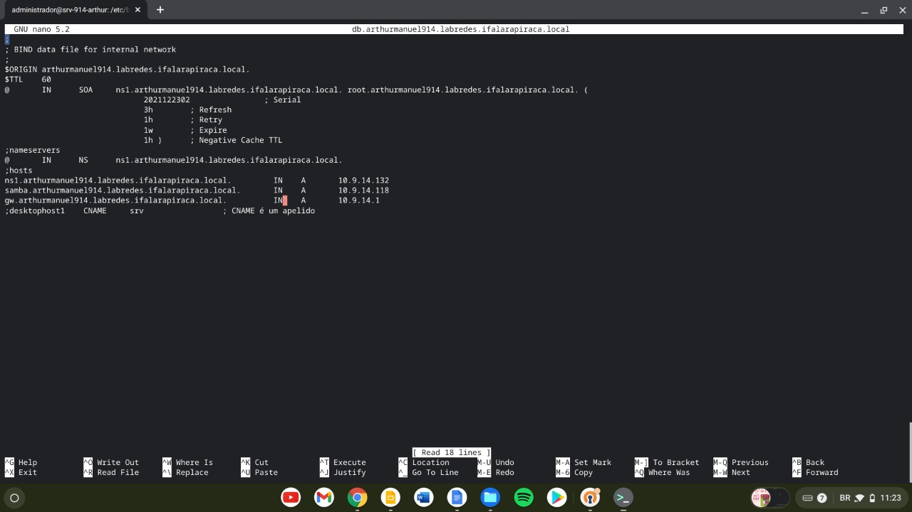
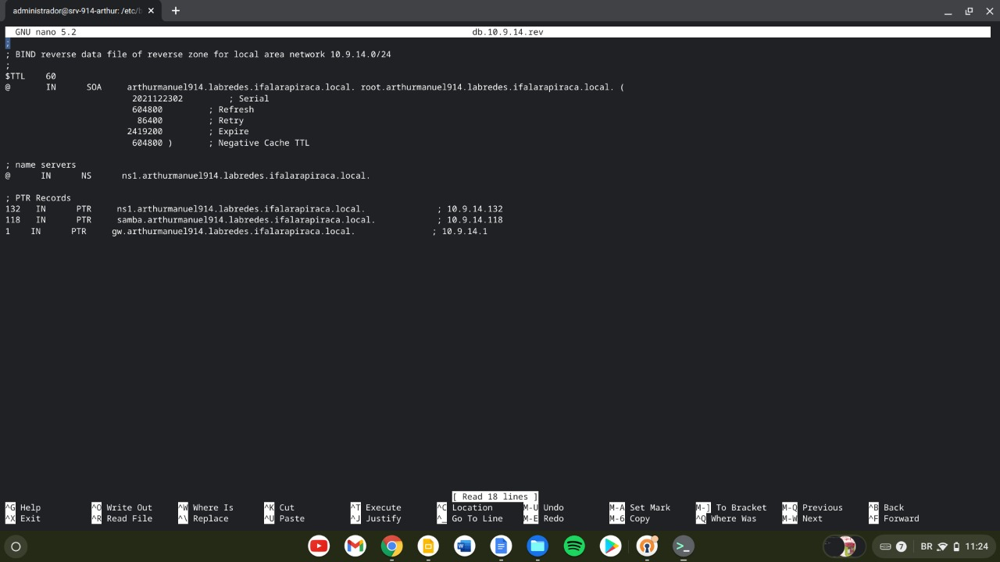

## Configurando o Bind9

> O Bind9 é um sistema de DNS flexivel e de fácil implementação que será a base para a configuração do sistema de nomes usado na nossa máquina que posteriormente será usado para fazer a ligação do cliente externo ao servidor samba

Antes de usarmos o Bind9 precisamos fazer a instalação do pacote

### Instalação
```shell
$ sudo apt update
$ sudo apt install sudo apt-get install bind9 dnsutils bind9-doc
```


> Após a instalação do bind9 podemos verificar o staus do serviço usando o comando

```shell
$ sudo systemctl status bind9
```


Agora com o bind9 configurado, precisamos configuarar as zonas que serão utilizadas no nosso "sistema de diretórios customizados" dentro do dns via bind9.

* primeiro criamos a pasta onde serão armazenadas as zonas, usando o comando
```shell
$ sudo mkdir /etc/bind/zones
```
* agora precisamos configurar as zonas dentro do diretório
  * criamos o arquivo de zona direta usando o padrão `db.nomedaduplaturma.labredes.ifalarapiraca.local` obtendo o resultado `db.arthurmanuel914.labredes.ifalarapiraca.local` baseado no template existente em `/etc/bind/zones/db.empty`
  ```shell
  $ sudo cp /etc/bind/db.empty /etc/bind/zones/db.arthurmanuel914.labredes.ifalarapiraca.local
  $ sudo nano /etc/bind/zones/db.arthurmanuel914.labredes.ifalarapiraca.local
  ```
  
  * editamos o arquivo de zona direta colocando as infromações referentes a dupla e ao sistema de nomes que será usado
  
  * agora criamos o arquivo de zona inversa, usando o IP referente da nossa máquina e template existente no bind9 bem semelhante a como foi configurado o direto
  * editamos o arquivo criado de configuração para inserir os dados referentes a nossa rede usando o comando
  ```shell
  $ sudo nano /etc/bind/zones/db.10.9.14.rev
  ```
  
* com os arquivos de zona devidamente configurados devemos agora ativa-los dentro da configuração do serviço de nomes, pra isso, precisamos editar o arquivo `/etc/bind/named.conf.local`
```shell
$ sudo nano /etc/bind/named.conf.local
```