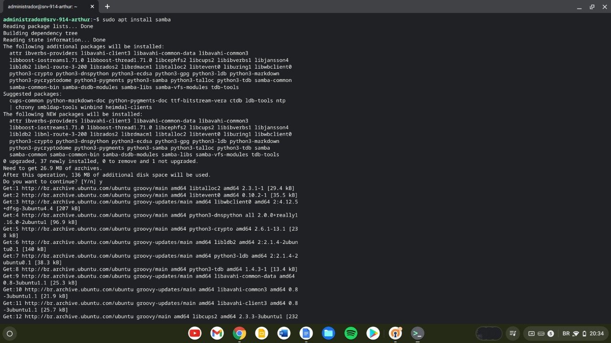
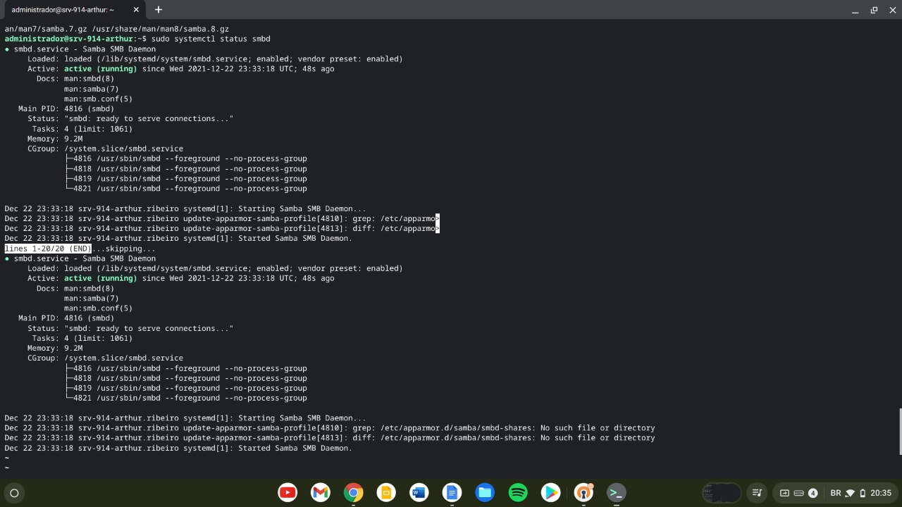
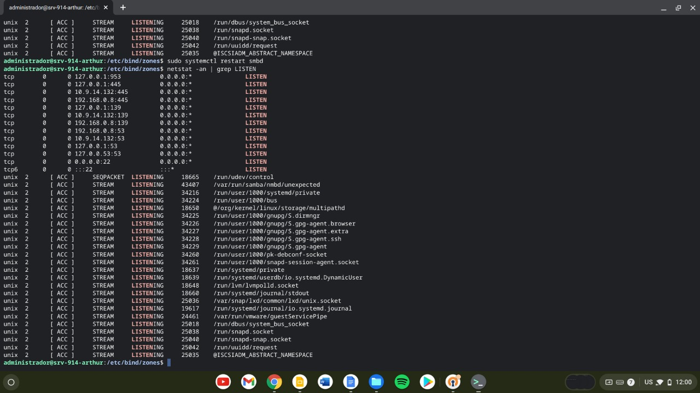
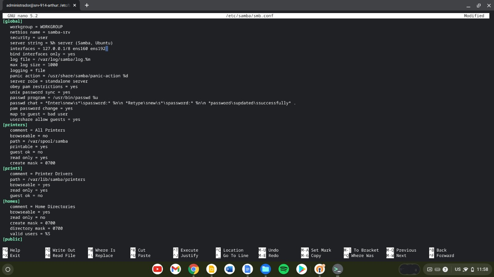
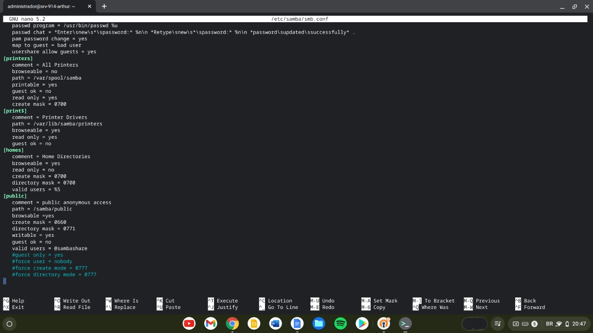
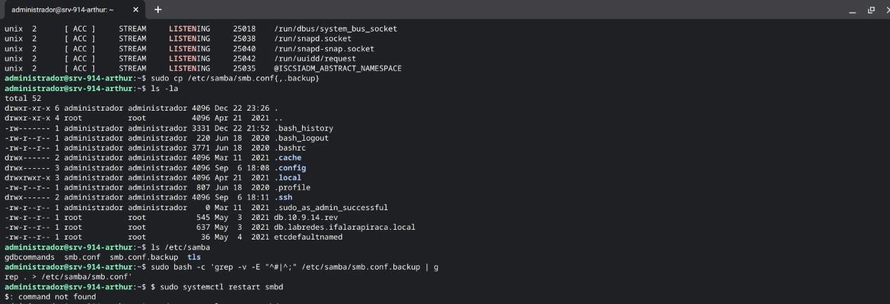
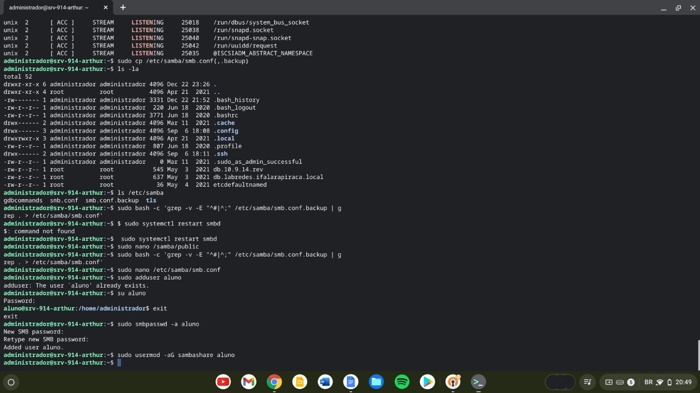

## Configurando Servidor Samba

> O Samba é um servidor de arquivos muito poderoso, que permite que não só consigamos compartilhar arquivos dentro de uma rede, mas ele atua como um serviço completo de simple storage, como o S3 da AWS ou Google Cloud Storage, com regras customizaveis e vários outros recursos

Antes de usarmos o Samba precisamos fazer a instalação do pacote

### Instalação
```shell
$ sudo apt update
$ sudo apt install samba
```


Após instalar podemos checar o status do funcionamento usando os comandos
```shell
$ sudo systemctl status smbd
$ netstat -an | grep LISTEN
```



> Com o samba em pleno funcionamento podemos fazer o backup das configurações iniciais dele e começarmos a personalizar!

### Configurando o Serviço
* abra o arquivo de configurações em `/etc/samba/smb.conf`
```shell
$ sudo nano /etc/samba/smb.conf
```
* agora vamos restringir o acesso aos usuários do grupo sambashare e adicionar opções de configurações mais especificas pra rede


* após configurarmos o samba, reiniciaremos o serviço pra que ele possa aplicar as configurações
```shell
$ sudo systemctl restart smbd
```

* após a reinicialização iremos configurar os dados de autenticação dentro do samba para permitir acessa-lo por via de uma autenticação baseada em senha, usando os comandos
```shell
$ sudo adduser aluno
$ sudo smbpasswd -a aluno
$ sudo usermod -aG sambashare aluno
```
